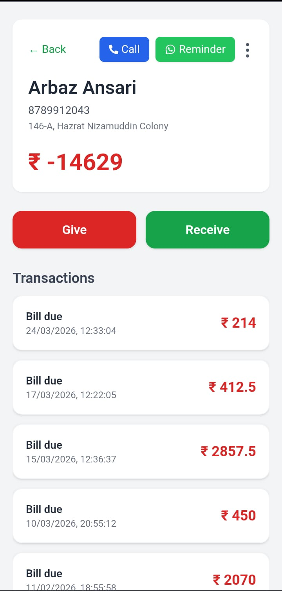
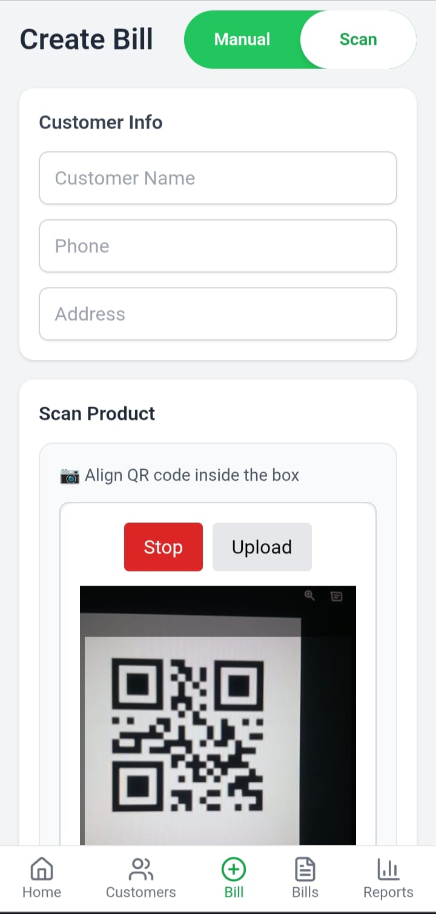
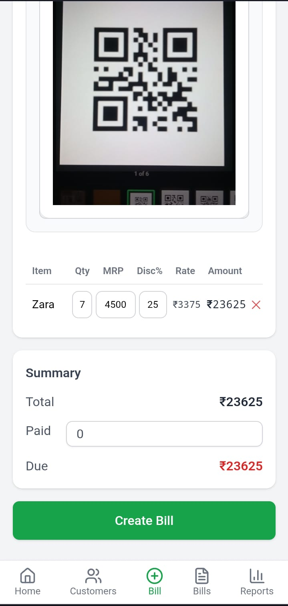
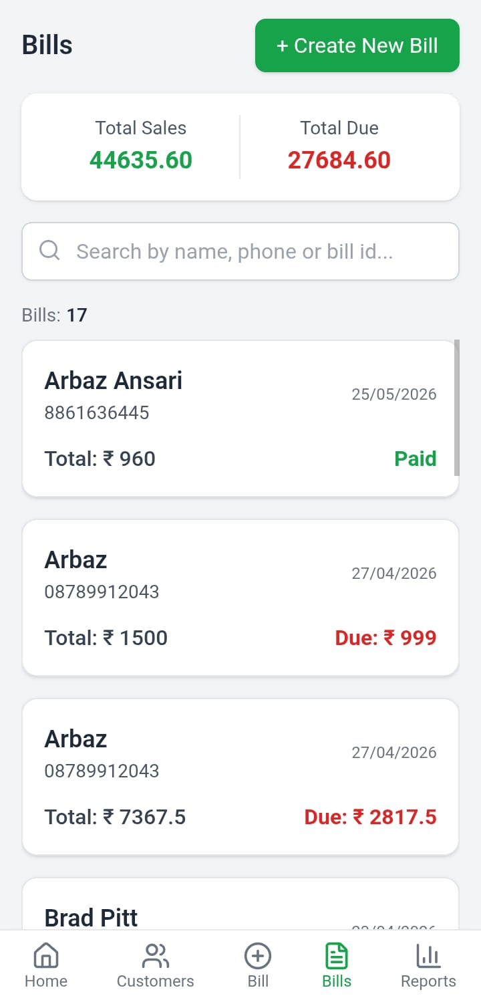
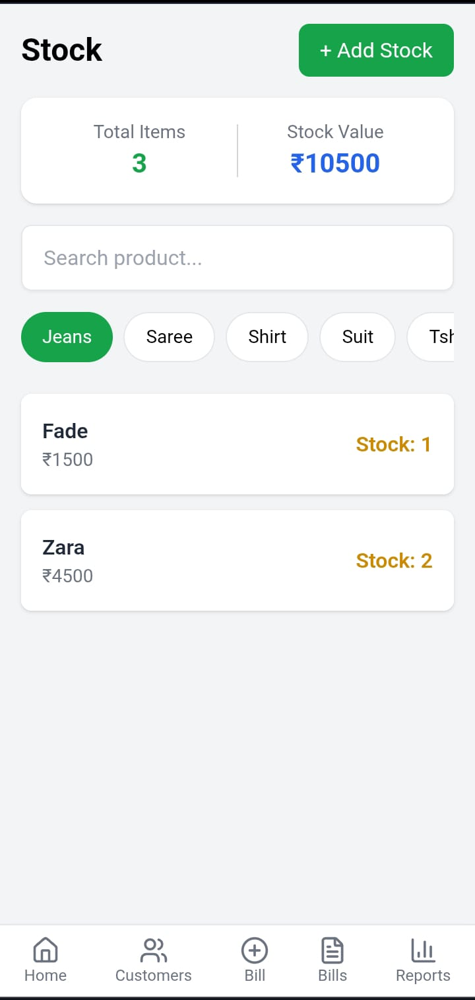
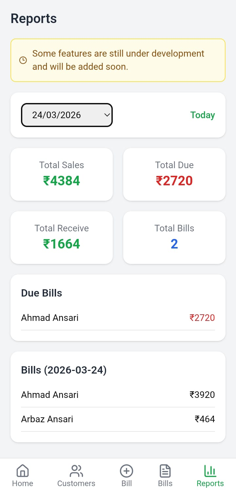

# KGN Collection — Shop Management System

[🔴 Live Demo](https://customer-ledger-chi.vercel.app/) •
[📂 Repository](https://github.com/arbazansari7933/customer-ledger)

A mobile-first retail management system built with the MERN stack for KGN Collection, currently used in production for billing, inventory management, and customer credit tracking.

---

## Highlights

- QR-based product scanning for billing
- Automatic stock deduction on sale
- Customer & wholesaler ledger management
- QR sticker generation with PDF export
- Daily sales reporting
- Backup & restore system
- PWA support for mobile installation

---

## Screenshots

<p align="center">
  
  
  
</p>

<p align="center">
  
  
  
</p>

---

## The Problem This Solves
Most small retail shops in India still write bills by hand or use basic calculators. Two things go wrong constantly:

**At billing** — the employee manually searches for a product, types the name, price, and discount. One typo = wrong bill. One forgotten discount = customer complaint. One missed item = revenue loss.

**At stock** — when the owner is away, there's no way to know if the employee sold items at the wrong price, gave an unauthorized discount, or simply didn't record a sale at all. The stock count drifts, and by the time the owner notices, it's already a mess.

This app fixes both.

---

## Core Features

### QR Scan Billing — No Manual Item Entry

The billing screen has a **Scan / Manual toggle**. In Scan mode, the phone camera opens and reads any QR code stuck on a product. The moment a code is detected:

- Product name, MRP, and discount auto-fill into the bill
- A beep sound plays to confirm the scan
- The item is added to the cart instantly
- If the same product is scanned again, the quantity increments — no duplicate rows
- A scan lock (800ms cooldown) prevents double-scan from a single trigger

The employee never types a product name or price. They just scan, enter quantity if needed, add the customer's phone number, and hit Create Bill.

```
Scan QR on product sticker
        │
        ▼
GET /api/products/:code
        │
        ▼
Product found → auto-fill into bill cart + beep
        │
Scan again → qty + 1 (no duplicate row)
```

For products without a QR sticker, Manual mode is still available — toggle switches the camera off and shows text input fields per item.

### Stock Protection — Bills Deduct Stock Automatically

Every time a bill is created, the backend checks stock before saving anything. If any item in the bill has insufficient stock, the entire bill is rejected with an error message. Nothing gets sold that isn't in stock.

```
Create Bill request
        │
        ▼
For each item with productId:
  product = Product.findById(item.productId)
  if product.stock < item.qty → reject entire bill
        │
All items pass
        │
        ▼
product.stock -= item.qty  (for each item)
Bill.create(...)
```

This means no employee can accidentally oversell. The stock count in the database always reflects real physical stock. The owner can check the stock page from anywhere and trust the numbers.

### QR Sticker Generator — The Other Half of the System

The QR system works because every product gets a sticker when it's added to inventory. When stock is added:

1. The backend generates a unique `productCode` (timestamp-based)
2. A QR code is generated from that code and returned to the frontend
3. The sticker generator page takes product name, design label, rate, and extra margin % — calculates the MRP automatically
4. Exports a print-ready PDF (60×40mm) with 1, 2, 4, 6, or 8 stickers per page

The sticker shows: shop name (KGN Collection), product name, design, MRP in large font, and a visual barcode pattern. Stick it on the product → now it's scannable at billing.

---

## All Features

**Customer Ledger** — Track how much each customer owes. Every transaction (credit given / payment received) updates their running balance. Full history with edit and delete. Balance is recalculated from scratch on every edit, not incremented by delta — so it never drifts.

**Wholesaler Ledger** — Same structure as customer ledger but for the supply side. Track what the shop owes to each wholesaler and record payments.

**Billing (POS)** — Itemised bills with per-item MRP, discount %, and auto-calculated final rate. Supports partial payment — the due amount is automatically added to the customer's ledger by phone number. If no customer account exists for that phone yet, one is created automatically.

**Inventory & Stock Page** — View all products, their category, current stock, and low-stock status. Add stock with category, price, GST, and discount.

**Daily Sales Reports** — Pick a date, see all bills for that day — total billed, collected, and dues.

**Purchase Calculator** — Utility for calculating cost price, margin, and selling price before buying from a wholesaler.

**Backup & Restore** — Download a full JSON export of all data in one click. Re-upload to restore. Works as an offline safety net on free-tier hosting.

**PWA** — Installable as a home screen app on Android. Works like a native app on the shop floor — full screen, no browser chrome.

---

## Tech stack

| Layer | Technology |
|---|---|
| Frontend | React.js, React Router v7, Tailwind CSS, Vite |
| Backend | Node.js, Express.js v5 |
| Database | MongoDB, Mongoose |
| Auth | JWT (Bearer token), bcryptjs |
| QR Scan | html5-qrcode (camera + image upload) |
| QR Generate | qrcode (server-side), qrcode.react |
| PDF / Sticker | jsPDF, html2canvas |
| Forms | react-hook-form |
| Animations | framer-motion |
| Icons | lucide-react, react-icons |
| File Upload | multer |
| PWA | manifest.json, service worker, app icons |

---

## Deployment

- Frontend: Vercel
- Backend: Render
- Database: MongoDB Atlas

---

## Architecture

### How QR scanning works end to end

```
1. Owner adds stock → productCode generated → QR created → sticker printed
2. Sticker stuck on product in shop
3. Employee opens billing → taps Scan mode
4. Camera opens → product QR scanned → GET /api/products/:code
5. Product auto-fills in bill cart + beep confirms
6. Bill submitted → backend deducts stock + auto-updates customer ledger
```

### How billing connects to the ledger automatically

When a bill has a due amount, the server finds the customer by phone and pushes a transaction to their ledger. No manual step required.

```
Bill created (due: ₹500)
        │
        ▼
Customer.findOne({ phone })
        │
   Not found ──▶ Customer.create({ balance: -500, transaction: [give ₹500] })
        │
   Found ──▶ customer.transaction.push(give ₹500)
             customer.balance -= 500
             customer.save()
```

### Why balance is recalculated, not incremented

On every transaction edit or delete, the balance is derived fresh from the full transaction array:

```js
customer.balance = customer.transaction.reduce((total, t) => {
  return t.type === "give" ? total - t.amount : total + t.amount;
}, 0);
```

This prevents drift. No matter how many edits happen in what order, the balance is always the true mathematical result of all transactions — not an accumulated counter that can go wrong.

---

## Project structure

```
customer-ledger-master/
├── backend/
│   ├── config/           # MongoDB connection
│   ├── controllers/      # auth, customer, wholesaler, bill, product, report, backup
│   ├── middlewares/      # JWT auth, role check
│   ├── models/           # User, Customer, Wholesaler, Bill, Product
│   ├── routes/           # Route definitions
│   ├── utils/            # QR code generator
│   └── server.js
│
└── frontend/
    └── src/
        ├── components/       # Navbar, BottomNavbar, Scanner, Cards
        ├── pages/
        │   ├── bills/        # AddBill (QR scan), BillDetails, BillPrint, EditBill
        │   ├── customers/    # Dashboard, Add, Edit, Details, Transactions
        │   ├── wholesalers/  # Same structure as customers
        │   ├── products/     # AddStock, StockPage
        │   ├── StickerGenerator.jsx
        │   ├── Reports.jsx
        │   ├── Settings.jsx  # Backup / Restore
        │   └── PurchaseCalculator.jsx
        └── utils/
            └── api.js        # Axios instance with base URL + auth header
```

---

## Running locally

**Prerequisites:** Node.js 18+, MongoDB (local or Atlas)

```bash
git clone https://github.com/arbazansari7933/customer-ledger.git
cd customer-ledger
```

**Backend:**

```bash
cd backend
npm install
```

Create `backend/.env`:

```
PORT=5000
MONGO_URI=mongodb://localhost:27017/kgn-collection
JWT_SECRET=your_minimum_32_char_secret_here
```

```bash
npm run dev
```

**Frontend:**

```bash
cd ../frontend
npm install
```

Create `frontend/.env`:

```
VITE_API_URL=http://localhost:5000/api
```

```bash
npm run dev
```

App runs at `http://localhost:5173`.

---

## Known limitations / what's next

- RBAC (owner vs employee roles) is fully scaffolded in middlewares and controllers but commented out — needs to be enabled before multi-user deployment
- Bill deletion does not currently reverse the customer's ledger balance
- CORS is open (`app.use(cors())`) — should be locked to the frontend domain in production
- No pagination on long customer/bill lists yet
- WhatsApp bill share from the print view
- Push notifications for overdue customer balances

---

## Author

**Arbaz Ansari**

B.Tech Computer Science Engineering

Built for KGN Collection, a real retail shop currently using this system in production.

- GitHub: [arbazansari7933](https://github.com/arbazansari7933)
- LinkedIn: [Arbaz Ansari](https://linkedin.com/in/arbaz-ansari-48b634330/)
