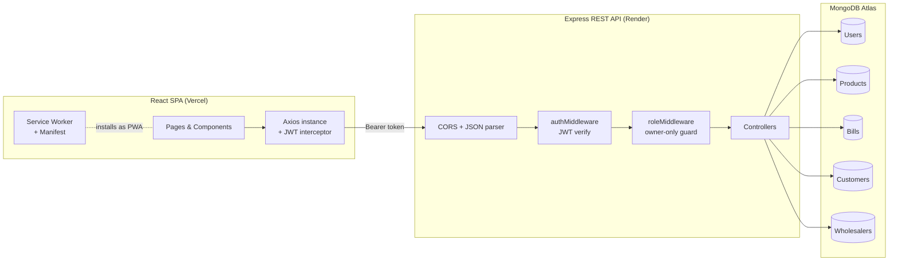
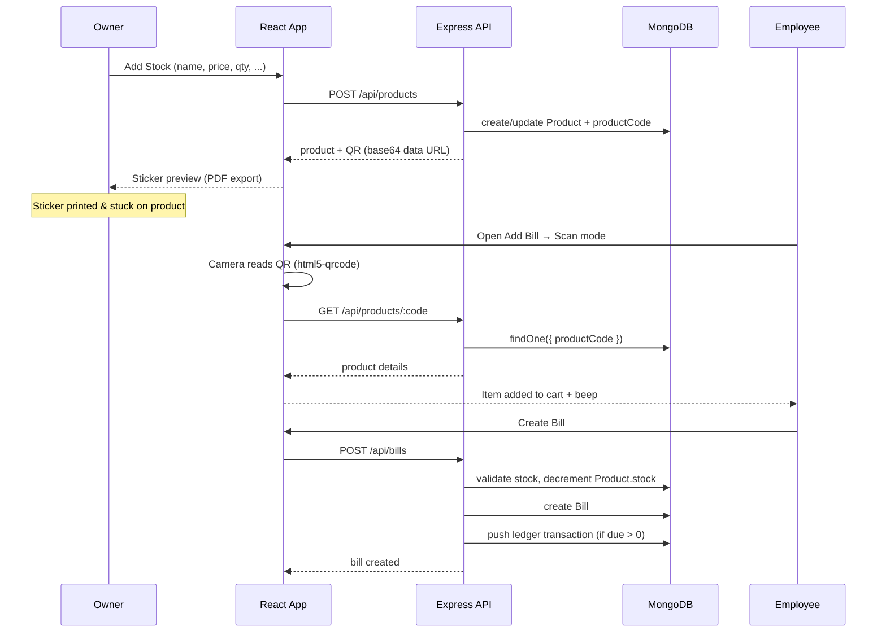
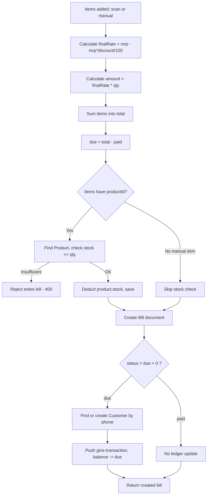
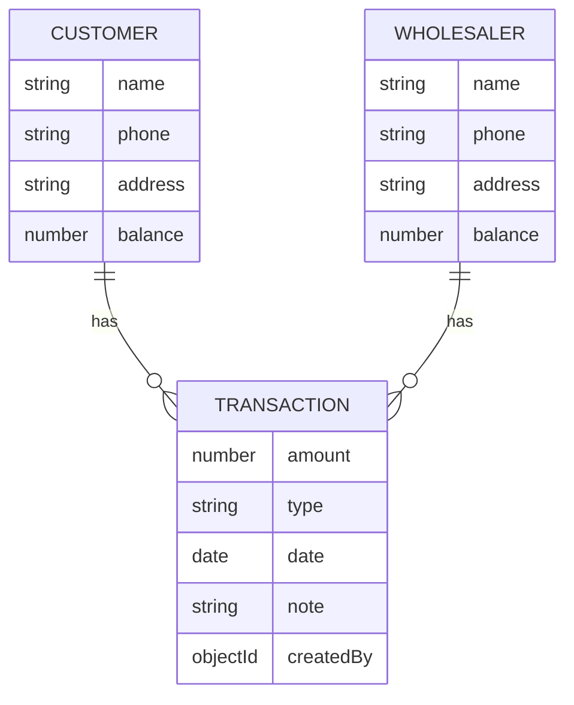
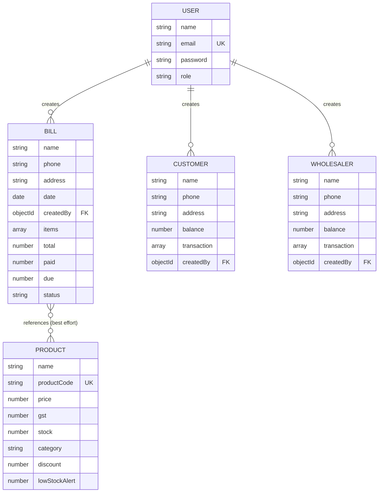

# KGN Collection — Shop Management System


**[🔴 Live Demo](https://customer-ledger-chi.vercel.app/) &nbsp;•&nbsp; [📂 Repository](https://github.com/arbazansari7933/customer-ledger)**

A mobile-first retail shop management system built with the MERN stack for **KGN Collection**, a real clothing retail shop. It replaces handwritten bills and manual stock counting with QR-based product scanning, automatic inventory deduction, customer/wholesaler ledgers with recalculated balances, thermal-style bill printing, and daily sales reporting — all wrapped in an installable PWA that runs like a native app on the shop counter.

This project is actively used in daily operations at the shop it was built for, and demonstrates practical full-stack engineering: JWT authentication with role-based route protection, a QR-driven point-of-sale flow, transactional ledger accounting, PDF/thermal print generation, and a mobile-first PWA shell.

---

## Table of Contents

- [Screenshots](#screenshots)
- [The Problem This Solves](#the-problem-this-solves)
- [Features](#features)
- [Tech Stack](#tech-stack)
- [System Architecture](#system-architecture)
- [QR Billing Workflow](#qr-billing-workflow)
- [Billing Workflow](#billing-workflow)
- [Inventory Management](#inventory-management)
- [Customer & Wholesaler Ledger](#customer--wholesaler-ledger)
- [QR Sticker Generation](#qr-sticker-generation)
- [Database Design](#database-design)
- [API Documentation](#api-documentation)
- [Folder Structure](#folder-structure)
- [Installation](#installation)
- [Environment Variables](#environment-variables)
- [Deployment](#deployment)
- [Engineering Decisions](#engineering-decisions)
- [Challenges Solved](#challenges-solved)
- [Known Limitations](#known-limitations)
- [Future Improvements](#future-improvements)
- [Code Review Suggestions](#code-review-suggestions)
- [Author](#author)
- [License](#license)

---

## Screenshots

<p align="center">
  
  
  
</p>
<p align="center">
  
  
  
</p>

> `[Architecture Diagram]` `[ER Diagram]` `[Sticker Generator]` `[Backup & Restore]` — placeholders for additional screenshots.

---

## The Problem This Solves

Small retail shops like KGN Collection traditionally run on handwritten bills, a calculator, and memory.

**Billing problems:** manual product/price entry, discount mistakes, duplicate line items, slow checkout during rush hours.

**Inventory problems:** stock counts drifting from what's physically on the shelf, no visibility into what sold when the owner isn't at the shop, tedious end-of-day reconciliation.

**Ledger problems:** credit given to regular customers tracked in a notebook, easy to lose or miscalculate, no easy history of who paid what and when.

KGN Collection solves this by making every product scannable, deducting stock automatically the moment a bill is created, and keeping a running, recalculated ledger balance for every customer and wholesaler.

---

## Features

### Authentication
- Email/password registration and login with **bcrypt** password hashing
- **JWT** (7-day expiry) issued on login, sent as a Bearer token
- First registered user automatically becomes `owner`; all subsequent signups default to `employee`
- An `OWNER_SECRET` invite code can be supplied at signup to force-assign the `owner` role
- Global axios interceptor auto-attaches the token to every request and force-redirects to `/login` on a `401`

### QR-Based Billing
- Camera-based QR scanning (live camera **or** image upload) using `html5-qrcode`
- Scan → auto-fill item into the bill cart → audible beep confirmation
- Re-scanning the same product increments quantity instead of adding a duplicate row
- 800ms scan-lock cooldown prevents a single physical scan from firing twice
- Manual entry mode toggle for products without a printed QR sticker

### Inventory Management
- Product creation with category, price, discount %, GST %, and starting quantity
- Adding stock for an existing product (same name + category) increments its stock instead of creating a duplicate
- **Automatic stock deduction** on every bill — stock is checked and decremented per item before the bill is saved
- Bill creation is rejected outright if any scanned/entered item doesn't have enough stock
- Manual stock adjustment endpoint (`+`/`-` change) with a floor at zero
- `lowStockAlert` threshold field on the product schema (default 5)
- Category browser and search-by-name/price on the Stock page

### Customer Ledger
- Auto-created customer record the first time a bill is left with a due amount
- Full transaction history per customer (`give` = credit extended, `receive` = payment collected)
- Balance is **recalculated from the full transaction array** on every edit/delete — never incremented by a delta
- Add / edit / delete individual transactions

### Wholesaler Ledger
- Same data model and recalculation logic as the customer ledger, mirrored for the supply side (money the shop owes wholesalers)

### Billing & POS
- Itemised bill with per-item MRP, discount %, auto-computed final rate and line amount
- Partial payment support — unpaid balance (`due`) is pushed to the customer's ledger automatically
- Bill status is derived (`paid` / `due`) from the due amount
- View, edit, and delete existing bills (edit and delete are `owner`-only)

### Sales Reports
- Pick any date and pull every bill created that day
- Totals for bills count, total sale, total collected, and total due, plus a list of bills still outstanding

### QR Sticker Generator
- Real, functional version lives inside **Add Stock**: after a product is saved, the backend returns a generated QR code (encoding the product's unique code) which is rendered on a 58×40mm sticker layout with shop name, product name, and MRP, and exported as a print-ready PDF via `html2canvas` + `jsPDF`
- A separate **Sticker Generator** page also exists as a standalone/manual layout tool (60×40mm, 1/2/4/6/8-up), but it is **not** wired to the backend and does not embed a real, scannable QR/barcode — see [Code Review Suggestions](#code-review-suggestions)

### Backup & Restore
- One-click JSON export of all collections (`users`, `bills`, `customers`, `wholesalers`, `products`)
- Restore endpoint (`owner`-only) wipes and re-inserts all collections from an uploaded JSON file — used as an offline safety net on free-tier hosting

### PDF & Thermal Bill Printing
- Bill receipt rendered at 80mm width, formatted like a thermal POS printout, exported to PDF via `html2canvas` + `jsPDF`

### Purchase Calculator
- Standalone rate × quantity calculator to estimate a purchase total before buying from a wholesaler (not persisted — client-side only)

### Progressive Web App (PWA)
- `manifest.json` with app icons, standalone display mode, and theme colors — installable to a phone's home screen
- A service worker is registered, but currently only logs installation and does not cache assets or enable offline use (see [Known Limitations](#known-limitations))

### Role-Based Access Control
- Two effective roles: `owner` and `employee` (a `demo` role also exists in the schema but isn't assigned anywhere)
- Route-level `checkRole(["owner"])` middleware protects destructive/financial actions: deleting or editing bills, customers, wholesalers, products, transactions; restoring backups; adjusting stock manually
- Finer-grained, per-record ownership checks (`createdBy` matches the requester) are written in the controllers but currently **commented out** — see [Code Review Suggestions](#code-review-suggestions)

### Settings
- Backup/Restore and account (login/signup) actions are functional
- "Shop Information" and "Bill Preferences" sections are static placeholders (`Edit` / `Configure` buttons with no wired handler) — flagged in-app with a "some features are still under development" notice

---

## Tech Stack

**Languages:** JavaScript (ES Modules, both frontend and backend)

**Frontend:** React 18, React Router v7, Vite, Tailwind CSS 3

**Backend:** Node.js, Express 5

**Database:** MongoDB with Mongoose (ODM)

**Authentication:** JSON Web Tokens (`jsonwebtoken`), `bcryptjs` for password hashing

**QR Technologies:** `html5-qrcode` (camera + image-upload scanning), `qrcode` (server-side QR generation), `qrcode.react` (available as a dependency for client-side QR rendering)

**PDF / Print Generation:** `jspdf`, `html2canvas`

**PWA:** Web App Manifest, custom (minimal) service worker

**Forms & UX:** `react-hook-form`, `framer-motion` (animations), `lucide-react` / `react-icons` (icons)

**File Uploads:** `multer` (used for the backup-restore JSON upload)

**HTTP Client:** `axios` with request/response interceptors

**Dev Tools:** `nodemon` (backend hot reload), ESLint (frontend)

**Hosting / Deployment:** Vercel (frontend), Render (backend), MongoDB Atlas (database)

---

## System Architecture

The application is a classic decoupled MERN setup: a Vite-built React SPA calls a stateless Express REST API over HTTPS, secured with JWT bearer tokens, backed by a single MongoDB database with five collections.



**Authentication flow:** Login returns a signed JWT (`id`, `role`) valid for 7 days. The frontend stores it in `localStorage` and an Axios request interceptor attaches it as `Authorization: Bearer <token>` on every call. On the backend, `authMiddleware` verifies the token, loads the user, and attaches it to `req.user`; `roleMiddleware`'s `checkRole([...])` then gates specific routes to the `owner` role.

**Request flow:** every protected route → CORS check (origin must match `CLIENT_URI`) → JWT verification → optional role check → controller → Mongoose model → MongoDB.

---

## QR Billing Workflow



---

## Billing Workflow



Key points, matching the actual controller logic:

- **Product validation** — for items carrying a `productId` (i.e. scanned items), the product must exist or the whole bill is rejected.
- **Stock validation** — happens *before* the bill document is created; the first understocked item aborts bill creation with a `400`.
- **Manual items** (no `productId`) skip stock checks entirely — the shop can still bill for products that were never added to inventory.
- **Discount handling** — a flat percentage per line item, applied before quantity.
- **Customer lookup / auto-creation** — only triggered when the bill has a `due > 0`; a brand-new customer is created with a negative balance if none exists for that phone number.

---

## Inventory Management

- **Product creation:** `POST /api/products` either creates a new `Product` with a generated `productCode` (`"PRD" + Date.now()`), or, if a product with the same `name` + `category` already exists, adds the incoming quantity to its existing stock and refreshes price/discount/GST.
- **Stock deduction:** happens exclusively inside `createBill`, item by item, only for items that carry a `productId`.
- **Manual stock adjustment:** `PATCH /api/products/:id/stock` accepts a signed `change` value and blocks any update that would push stock below zero.
- **Low stock:** the schema stores a per-product `lowStockAlert` threshold (default `5`), but no endpoint or UI currently surfaces a "low stock" list or alert — the field is defined but not yet consumed.

---

## Customer & Wholesaler Ledger

Both ledgers share an identical shape: a parent document (`Customer` / `Wholesaler`) with an embedded array of `transaction` sub-documents (`amount`, `type: "give" | "receive"`, `date`, `note`, `createdBy`), plus a `balance` field.



**Direction of `give` / `receive` is intentionally opposite between the two ledgers**, because they represent opposite sides of money owed:

- **Customer:** `give` = shop extends credit to the customer → balance **decreases** (shop is owed money). `receive` = customer pays → balance **increases**.
- **Wholesaler:** `give` = shop pays the wholesaler → balance **increases** (less owed). `receive` = wholesaler extends credit / shop owes more → balance **decreases**.

**Editing and deleting transactions:** both operations locate the transaction sub-document by `_id`, mutate or remove it, and then run:

```js
customer.balance = customer.transaction.reduce((total, t) => {
  return t.type === "give" ? total - t.amount : total + t.amount;
}, 0);
```

**Why recalculate instead of increment:** if the balance were updated with `balance += / -= amount` on every edit, any missed edge case (a failed request retried, an edit applied twice, a race between two requests) would leave the stored balance silently wrong with no way to detect it. Recalculating from the full transaction history on every write makes the balance a pure, always-correct function of the ledger — it can never drift.

---

## QR Sticker Generation

The functional sticker/QR pipeline lives in **Add Stock → Stock page**:

1. Owner submits name, category, price, discount, GST, and quantity.
2. Backend either updates an existing product's stock or creates a new one with a unique `productCode` (`"PRD" + timestamp`).
3. `generateQR()` (a thin wrapper around the `qrcode` package) encodes the `productCode` into a base64 PNG data URL and returns it alongside the product.
4. The frontend renders a 58mm × 40mm sticker preview (shop name, product name, MRP, and the real QR image).
5. `html2canvas` rasterizes that preview and `jsPDF` exports it as a print-ready PDF sized to the sticker, ready to send to a thermal/label printer.

A second page, **Sticker Generator**, offers a similar layout (product, design, computed MRP, 1–8-up printing) but is a client-only utility: it does not call the backend, has no `productCode`, and renders a randomized bar pattern rather than a real barcode/QR — it cannot be scanned at billing time. See [Code Review Suggestions](#code-review-suggestions).

---

## Database Design

Five Mongoose collections, all in a single MongoDB database.



- **User** — `name`, `email` (unique), hashed `password`, `role` (`owner` | `employee` | `demo`, defaults to `employee`).
- **Product** — `name`, unique `productCode` (QR payload), `price`, `gst`, `stock`, `category`, `discount`, `lowStockAlert`.
- **Bill** — customer snapshot (`name`, `phone`, `address` at time of billing), embedded `items[]` (each with `itemName`, `qty`, `mrp`, `discount`, `finalRate`, `amount`), `total`, `paid`, `due`, derived `status`, and `createdBy` (the employee/owner who created it).
- **Customer** — running `balance` plus an embedded `transaction[]` ledger array; auto-created from bills with a due amount, or manually via "Add Customer."
- **Wholesaler** — identical shape to `Customer`, for the supply side.

**Relationships:** `Bill`, `Customer`, and `Wholesaler` each reference the `User` who created them via `createdBy`. `Bill.items` are intended to reference `Product` by `productId`, but that field is not currently part of the persisted `Bill` item schema — see [Code Review Suggestions](#code-review-suggestions).

---

## API Documentation

All routes are prefixed with `/api`. 🔒 = requires a valid JWT (`authMiddleware`). 👑 = additionally requires the `owner` role (`checkRole(["owner"])`).

### Auth — `/api/auth`

| Method | Endpoint | Auth | Description | Body | Success Response |
|---|---|---|---|---|---|
| POST | `/register` | Public | Create a user; first user ever becomes `owner`, others default to `employee` (or `owner` if `inviteCode` matches `OWNER_SECRET`) | `{ name, email, password, inviteCode? }` | `201` `{ message, roleAssigned, userId }` |
| POST | `/login` | Public | Authenticate and receive a JWT | `{ email, password }` | `200` `{ message, token, user }` |

### Products — `/api/products`

| Method | Endpoint | Auth | Description | Body / Params | Success Response |
|---|---|---|---|---|---|
| GET | `/categories` | 🔒 | Distinct list of product categories | — | `200` `[categories]` |
| GET | `/categories/:name` | 🔒 | All products in a category | `name` (path) | `200` `[products]` |
| GET | `/` | 🔒 | All products, newest first | — | `200` `[products]` |
| GET | `/id/:id` | 🔒 | Single product by Mongo `_id` | `id` (path) | `200` product / `404` |
| GET | `/:code` | 🔒 | Single product by `productCode` (used by the POS scanner) | `code` (path) | `200` `{ success, product }` / `404` |
| POST | `/` | 🔒 | Add stock — creates a product or tops up an existing one, returns a generated QR | `{ name, category, price, gst?, discount?, quantity }` | `200` `{ success, product, qr, quantity }` |
| DELETE | `/:id` | 🔒👑 | Delete a product | `id` (path) | `200` `{ success, message }` |
| PATCH | `/:id/stock` | 🔒👑 | Manually adjust stock by a signed amount | `{ change }` | `200` `{ success, product }` / `400` if it would go negative |

### Bills — `/api/bills`

| Method | Endpoint | Auth | Description | Body / Params | Success Response |
|---|---|---|---|---|---|
| POST | `/` | 🔒 | Create a bill — validates stock, deducts it, creates the bill, updates the customer's ledger if there's a due amount | `{ name, phone, address, items[], paid? }` | `201` `{ message, bill }` |
| GET | `/` | 🔒 | All bills, newest first | — | `200` `{ message, bills }` |
| GET | `/:billId` | 🔒 | Single bill by id | `billId` (path) | `200` `{ message, bill }` / `400` |
| PUT | `/:id` | 🔒👑 | Overwrite a bill's fields (name, phone, address, items, total, paid, due) and re-derive status | `{ name, phone, address, items, total, paid, due }` | `200` `{ message, bill }` |
| DELETE | `/:billId` | 🔒👑 | Delete a bill | `billId` (path) | `200` `{ message, bill }` |

### Customers — `/api/customers`

| Method | Endpoint | Auth | Description | Body / Params | Success Response |
|---|---|---|---|---|---|
| POST | `/` | 🔒 | Add a customer | `{ name, phone, address }` | `201` `{ message, customer }` |
| GET | `/` | 🔒 | All customers, newest first | — | `200` `{ message, customers }` |
| GET | `/:customerId` | 🔒 | Single customer | `customerId` (path) | `200` `{ message, customer }` |
| PUT | `/:customerId` | 🔒👑 | Edit name/phone/address | `{ name, phone, address }` | `200` `{ message, updatedCustomer }` |
| DELETE | `/:customerId` | 🔒👑 | Delete a customer | `customerId` (path) | `200` `{ message, customer }` |
| POST | `/:customerId/transactions` | 🔒👑 | Add a ledger transaction, updates balance | `{ amount, type, note }` | `200` `{ message, customer }` |
| GET | `/:customerId/transactions/:transactionId` | 🔒 | Single transaction | path params | `200` `{ message, transaction }` |
| PUT | `/:customerId/transactions/:transactionId` | 🔒👑 | Edit a transaction, recalculates balance | `{ amount, type, note }` | `200` `{ message, customer }` |
| DELETE | `/:customerId/transactions/:transactionId` | 🔒👑 | Delete a transaction, recalculates balance | path params | `200` `{ message, customer }` |

### Wholesalers — `/api/wholesalers`

| Method | Endpoint | Auth | Description | Body / Params | Success Response |
|---|---|---|---|---|---|
| POST | `/` | 🔒 | Add a wholesaler | `{ name, phone, address }` | `201` `{ message, wholesaler }` |
| GET | `/` | 🔒 | All wholesalers, newest first | — | `200` `{ message, wholesalers }` |
| GET | `/:wholesalerId` | 🔒 | Single wholesaler | `wholesalerId` (path) | `200` `{ message, wholesaler }` |
| PUT | `/:wholesalerId` | 🔒👑 | Edit name/phone/address | `{ name, phone, address }` | `200` `{ message, updatedwholesaler }` |
| DELETE | `/:wholesalerId` | 🔒👑 | Delete a wholesaler | `wholesalerId` (path) | `200` `{ message, wholesaler }` |
| POST | `/:wholesalerId/transactions` | 🔒👑 | Add a ledger transaction (inverted give/receive logic vs. customer) | `{ amount, type, note }` | `200` `{ message, wholesaler }` |
| GET | `/:wholesalerId/transactions/:transactionId` | 🔒
